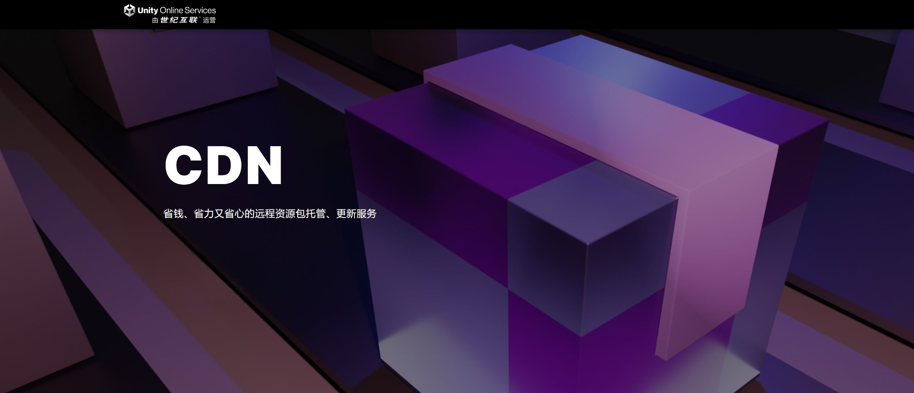

# 小游戏宿主

Unity 小游戏宿主一体化平台的接入与 UOS CDN 融合配置。

Unity 小游戏宿主是融合了客户端 SDK、服务端 API 以及管理后台的一体化综合性小游戏运行平台。该平台最大亮点在于全平台的覆盖，全面支持 Android 和 iOS 系统，无论用户使用何种设备，都能获得流畅的游戏体验。

小游戏宿主的安装以及配置教程，请参考官方文档：https://minihost.tuanjie.cn/help/docs/welcome

**注意事项**

1. 不支持同步加载
2. 不支持下载器

**文件系统初始化**

````csharp
IEnumerator InitPackage()
{
    // 创建远程服务类
    string defaultHostServer = GetHostServerURL();
    string fallbackHostServer = GetHostServerURL();
    IRemoteService remoteService = new RemoteService(defaultHostServer, fallbackHostServer);
    
    // 创建初始化参数
    var createParameters = new WebPlayModeOptions();
    createParameters.WebNetworkFileSystemParameters = FileSystemParameters.CreateDefaultWebNetworkFileSystemParameters(remoteService);
    
    // 初始化ResourcePackage
    yield return package.InitializePackageAsync(createParameters);
}
````

**UOS CDN**



UOS CDN 是 Unity 官方推出的资源更新服务，可以帮助开发者轻松部署和管理远程资源包。官方文档：https://uos.unity.cn/

小游戏宿主和UOS CDN做了深度融合，在使用的时候注意事项如下：

```csharp
private string GetHostServerURL()
{
    // 可以通过官方接口直接获取配置的CDN根目录
    string cdn = minihost.TJ.GetDataCDN();
    return cdn;
}

IEnumerator InitPackage()
{
    // 请求资源版本
    bool appendTimeTicks = false; //注意：UOS CDN需要关闭URL尾部自动添加的时间戳!
    var operation = package.RequestPackageVersionAsync(new RequestPackageVersionOptions(appendTimeTicks, 60));
    yield return operation;  
}
```

了解如何接入YooAsset ：https://uos.unity.cn/doc/cdn/yoo-asset
