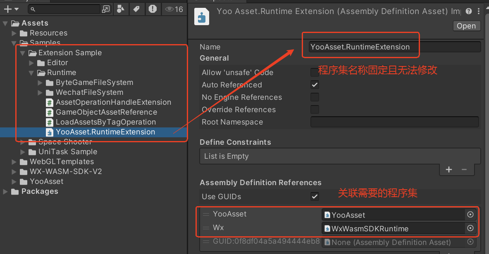

# [文件系统] 如何扩展文件系统

通过继承 IFileSystem 接口实现定制化的文件系统。

YooAsset提供了一个可扩展的文件系统接口（IFileSystem接口）。业务层可以通过继承并实现该接口，来实现定制化的文件系统类，满足项目的各类需求。

YooAsset的内部类型和接口全部做了internal修饰符，要想访问或者继承这些类或接口，需要将代码放置到特定的程序集下。

可以直接导入Sample工程到本地开发工程里。



### 适用场景

通常情况下，优先使用YooAsset默认提供的文件系统即可。

1. `EditorFileSystem`：编辑器模拟运行。
2. `BuiltinFileSystem`：离线模式，加载包体内资源。
3. `SandboxFileSystem`：联机模式，管理远端下载和沙盒缓存。
4. `WebServerFileSystem`和`WebNetworkFileSystem`：WebGL和小游戏平台。

只有在平台文件访问机制特殊，或默认文件系统无法满足项目需求时，才建议扩展文件系统。

常见场景如下：

1. 小游戏平台需要接入平台专属缓存目录。
2. Android平台需要通过Google Play Asset Delivery加载资源。
3. WebGL平台需要替换默认下载、缓存或清理逻辑。
4. 项目需要完全接管资源包的加载、下载、解包或缓存清理流程。

### 创建文件系统参数

文件系统通过`FileSystemParameters`创建。第一个参数是文件系统类型的完整名称，格式如下：

```csharp
"命名空间.类型名,程序集名称"
```

`FileSystemParameters`会在初始化包裹时通过反射创建文件系统实例，并依次执行以下流程：

1. 调用`SetParameter()`写入自定义参数。
2. 调用`OnCreate()`初始化文件系统根目录和内部状态。
3. 调用`InitializeAsync()`执行异步初始化流程。

### 扩展方式

文件系统接口`IFileSystem`是YooAsset内部接口。扩展时通常有两种方式：

1. 继承已有文件系统，只重写差异逻辑。
2. 完整实现`IFileSystem`，完全接管文件系统行为。

更推荐第一种方式。比如小游戏扩展里，可以基于默认Web网络文件系统扩展平台缓存和清理逻辑：

```csharp
internal class CustomWebFileSystem : WebNetworkFileSystem
{
    private string _cacheRoot;

    public override void OnCreate(string packageName, string packageRoot)
    {
        _cacheRoot = packageRoot;
        base.OnCreate(packageName, packageRoot);
    }

    public override FSClearCacheOperation ClearCacheAsync(FSClearCacheOptions options)
    {
        // 在这里接入平台专属缓存清理逻辑。
        return base.ClearCacheAsync(options);
    }
}
```

如果只需要替换某一个阶段，也可以继承已有文件系统并重写对应方法。例如Google Play Asset Delivery场景可以重写资源包加载逻辑：

```csharp
internal class GooglePlayFileSystem : BuiltinFileSystem, IFileSystem
{
    public new FSLoadPackageBundleOperation LoadPackageBundleAsync(FSLoadPackageBundleOptions options)
    {
        var operation = new GPFSLoadPackageBundleOperation(this, options);
        return operation;
    }
}
```

### 接口职责

`IFileSystem`的核心职责可以分为以下几类：

| 方法 | 说明 |
| --- | --- |
| `InitializeAsync()` | 初始化文件系统。 |
| `RequestPackageVersionAsync()` | 查询资源版本。 |
| `LoadPackageManifestAsync()` | 加载资源清单。 |
| `LoadPackageBundleAsync()` | 加载资源包。 |
| `EnsurePackageBundleAsync()` | 确保资源包文件已就绪。 |
| `DownloadBundleAsync()` | 下载、解包或导入资源包。 |
| `ClearCacheAsync()` | 清理缓存文件。 |
| `CanAcceptBundle()` | 判断文件系统是否可以接管指定资源包。 |
| `IsDownloadRequired()` | 判断资源包是否需要下载。 |
| `IsUnpackRequired()` | 判断资源包是否需要解包。 |
| `IsImportRequired()` | 判断资源包是否需要导入。 |
| `OnDestroy()` | 销毁文件系统并释放内部资源。 |

### 注意事项

1. YooAsset的文件系统相关核心类型多数是`internal`，扩展代码需要放在允许访问这些内部类型的程序集下。
2. 自定义文件系统类型必须能被`Type.GetType()`找到，因此`FileSystemParameters`里的类型名和程序集名要填写准确。
3. 如果只是想调整解密、下载请求、内置文件读取、解包策略等行为，优先使用文件系统参数，不一定需要自定义完整文件系统。
4. 完整实现`IFileSystem`成本较高，需要正确处理初始化、清单加载、Bundle加载、下载、解包、导入、缓存清理和销毁等流程。
5. 推荐优先参考`Samples~`目录里的小游戏文件系统和Google Play文件系统示例，再根据项目需求做局部扩展。
