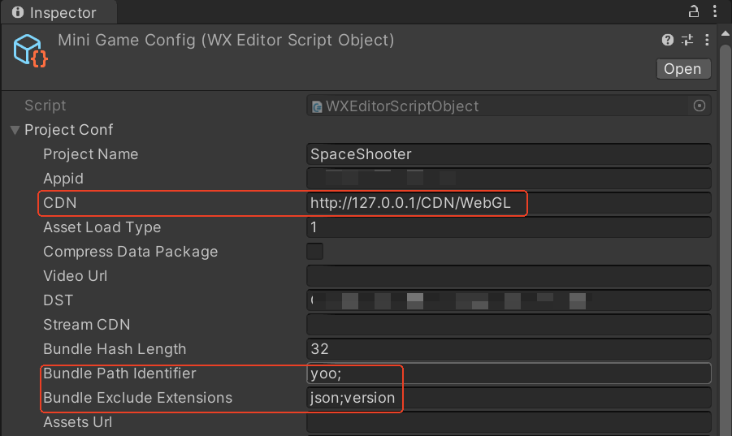
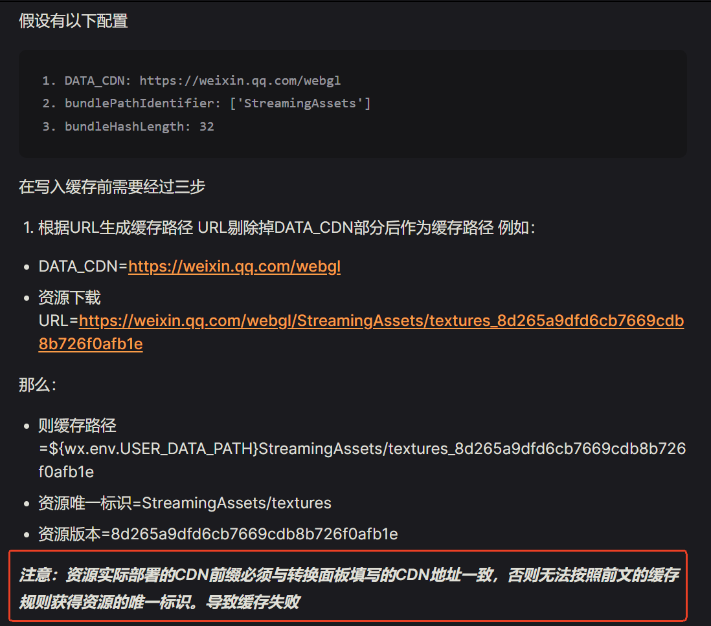
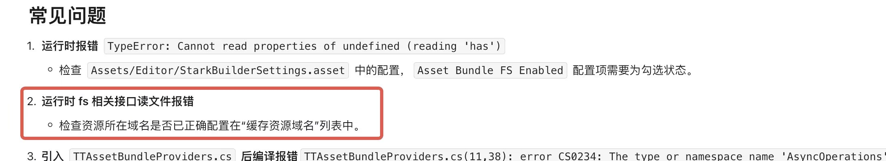

# 小游戏方案

了解如何使用YooAsset接入小游戏平台。

### 网页游戏

**文件系统注意事项**

1. 不支持同步加载
2. 不支持下载器

**文件系统初始化**

````csharp
IEnumerator InitPackage()
{
    // 创建远程服务类
    string defaultHostServer = GetHostServerURL();
    string fallbackHostServer = GetHostServerURL();
    IRemoteService remoteService = new RemoteService(defaultHostServer, fallbackHostServer);
    
    // 创建初始化参数
    var createParameters = new WebPlayModeOptions();
    createParameters.WebNetworkFileSystemParameters = FileSystemParameters.CreateDefaultWebNetworkFileSystemParameters(remoteService);
    createParameters.WebServerFileSystemParameters = FileSystemParameters.CreateDefaultWebServerFileSystemParameters();
    
    // 初始化ResourcePackage
    yield return package.InitializePackageAsync(createParameters);
}
````

```csharp
private class RemoteService : IRemoteService
{
    private readonly string _defaultHostServer;
    private readonly string _fallbackHostServer;

    public RemoteService(string defaultHostServer, string fallbackHostServer)
    {
        _defaultHostServer = defaultHostServer;
        _fallbackHostServer = fallbackHostServer;
    }

    public IReadOnlyList<string> GetRemoteUrls(string fileName)
    {
        return new[]
        {
            $"{_defaultHostServer}/{fileName}",
            $"{_fallbackHostServer}/{fileName}"
        };
    }
}
```

Web网络文件系统支持RawBundle和ArchiveBundle加载。若需要加载加密资源包，可在文件系统参数里按需配置 `AssetBundleDecryptor`、`RawBundleDecryptor` 或 `ArchiveBundleDecryptor`。


### 小游戏宿主

Unity 小游戏宿主是融合了客户端 SDK、服务端 API 以及管理后台的一体化综合性小游戏运行平台。该平台最大亮点在于全平台的覆盖，全面支持 Android 和 iOS 系统，无论用户使用何种设备，都能获得流畅的游戏体验。

小游戏宿主的安装以及配置教程，请参考官方文档：https://minihost.tuanjie.cn/help/docs/welcome

**文件系统注意事项**

1. 不支持同步加载
3. 不支持下载器

**文件系统初始化**

````csharp
IEnumerator InitPackage()
{
    // 创建远程服务类
    string defaultHostServer = GetHostServerURL();
    string fallbackHostServer = GetHostServerURL();
    IRemoteService remoteService = new RemoteService(defaultHostServer, fallbackHostServer);
    
    // 创建初始化参数
    var createParameters = new WebPlayModeOptions();
    createParameters.WebNetworkFileSystemParameters = FileSystemParameters.CreateDefaultWebNetworkFileSystemParameters(remoteService);
    
    // 初始化ResourcePackage
    yield return package.InitializePackageAsync(createParameters);
}
````

**UOS CDN**

UOS CDN 是 Unity 官方推出的资源更新服务，可以帮助开发者轻松部署和管理远程资源包。官方文档：https://uos.unity.cn/

小游戏宿主和UOS CDN做了深度融合，在使用的时候注意事项如下：

```csharp
private string GetHostServerURL()
{
    // 可以通过官方接口直接获取配置的CDN根目录
    string cdn = minihost.TJ.GetDataCDN();
    return cdn;
}

IEnumerator InitPackage()
{
    // 请求资源版本
    bool appendTimeTicks = false; //注意：UOS CDN需要关闭URL尾部自动添加的时间戳!
    var operation = package.RequestPackageVersionAsync(new RequestPackageVersionOptions(appendTimeTicks, 60));
    yield return operation;  
}
```


### 微信小游戏

首先安装WX-WASM-SDK-V2 Unity插件，然后导入微信文件系统相关代码。

微信文件系统相关代码在扩展工程内：Mini Game --> Runtime --> [WechatFileSystem](https://github.com/tuyoogame/YooAsset/tree/yoo3/Assets/YooAsset/Samples~/Mini%20Game/Runtime/WechatFileSystem)

**文件系统注意事项**

1. 不支持同步加载
3. 不支持下载器

**其它注意事项**

- 构建的Bundle文件名称不要带有中文！
- StreamingAssets目录不需要放置任何资产！

- 一定要禁止对资源清单版本文件进行缓存（文件名称样例：yourPackageName.version）
- URL地址里不要包含双反斜杠，例如：www.cdn.com/v1.0/android//xxx.bundle 双反斜杠会导致微信插件加载文件失败，但网络请求又不返回失败！
- URL地址里不要包含windows的斜杠，例如：@"\\" 或者 "\\\\"
- URL地址里不要带端口信息，例如：http://127.0.0.1:80

**文件系统初始化**

````csharp
IEnumerator InitPackage()
{
    // 创建远程服务类
    string defaultHostServer = GetHostServerURL();
    string fallbackHostServer = GetHostServerURL();
    IRemoteService remoteService = new RemoteService(defaultHostServer, fallbackHostServer);
    
    // 小游戏缓存根目录
    // 注意：此处代码根据微信插件配置来填写！
    string packageRoot = $"{WeChatWASM.WX.env.USER_DATA_PATH}/__GAME_FILE_CACHE/yoo";
    //string packageRoot = $"{WeChatWASM.WX.PluginCachePath}/yoo";
    
    // 创建初始化参数
    var createParameters = new WebPlayModeOptions();
    createParameters.WebNetworkFileSystemParameters = WechatFileSystemCreater.CreateFileSystemParameters(packageRoot, remoteService, null);
    
    // 初始化ResourcePackage
    yield return package.InitializePackageAsync(createParameters);
}
````

**微信插件配置**

假设CDN地址为：http://127.0.0.1/CDN/WebGL/yoo/ (该目录下存储的是热更文件)

根据下图配置，则初始化代码PackageRoot设置为

```csharp
string packageRoot = $"{WeChatWASM.WX.env.USER_DATA_PATH}/__GAME_FILE_CACHE/yoo";
//string packageRoot = $"{WeChatWASM.WX.PluginCachePath}/yoo";
```



**微信官方文档**

文档：https://developers.weixin.qq.com/minigame/dev/guide/game-engine/unity-webgl-transform.html



**常见问题**

1. WXUnload a bundle not loaded by WXAssetBundle

   一般是由于CDN填写地址和实际提供的下载地址不一致导致的。

2. MethodAccessException: Attempt to access method 'YooAsset.IFileSystem.RequestPackageVersionAsync' on type ' ' failed.

   查看日志里是否包含其它异常日志，例如：Exception: IRemoteService returned URL contains double slashes.


### 抖音小游戏

首先安装字节小游戏相关的Unity插件，然后导入抖音文件系统相关代码。

抖音文件系统相关代码在扩展工程内：Mini Game --> Runtime --> [TiktokFileSystem](https://github.com/tuyoogame/YooAsset/tree/yoo3/Assets/YooAsset/Samples~/Mini%20Game/Runtime/TiktokFileSystem)

**文件系统注意事项**

1. 不支持同步加载
1. 不支持下载器

**文件系统初始化**

````csharp
IEnumerator InitPackage()
{
    // 创建远程服务类
    string defaultHostServer = GetHostServerURL();
    string fallbackHostServer = GetHostServerURL();
    IRemoteService remoteService = new RemoteService(defaultHostServer, fallbackHostServer);
    
    // 创建解密服务类
    IBundleDecryptor decryptor = null; //如需资源加密，请传入自定义解密器实例。
    
    // 创建初始化参数
    var createParameters = new WebPlayModeOptions();
    createParameters.WebNetworkFileSystemParameters = TiktokFileSystemCreater.CreateFileSystemParameters(remoteService, decryptor);
    
    // 初始化ResourcePackage
    yield return package.InitializePackageAsync(createParameters);
}
````

**其它注意事项**

- 一定要禁止对资源清单版本文件进行缓存（文件名称样例：yourPackageName.version）




### 其它小游戏平台

支付宝小游戏：Mini Game --> Runtime --> [AlipayFileSystem](https://github.com/tuyoogame/YooAsset/tree/yoo3/Assets/YooAsset/Samples~/Mini%20Game/Runtime/AlipayFileSystem)

Taptap小游戏：Mini Game --> Runtime --> [TaptapFileSystem](https://github.com/tuyoogame/YooAsset/tree/yoo3/Assets/YooAsset/Samples~/Mini%20Game/Runtime/TaptapFileSystem)

OPPO小游戏：Mini Game --> Runtime --> [OppoFileSystem](https://github.com/tuyoogame/YooAsset/tree/yoo3/Assets/YooAsset/Samples~/Mini%20Game/Runtime/OppoFileSystem)

vivo小游戏：Mini Game --> Runtime --> [VivoFileSystem](https://github.com/tuyoogame/YooAsset/tree/yoo3/Assets/YooAsset/Samples~/Mini%20Game/Runtime/VivoFileSystem)

快手小游戏：Mini Game --> Runtime --> [KuaiShouFileSystem](https://github.com/tuyoogame/YooAsset/tree/yoo3/Assets/YooAsset/Samples~/Mini%20Game/Runtime/KuaiShouFileSystem)

**注意：链接目录下内置了说明文档**


### 安卓分包方案

建议使用InstallTime模式，解压后会自动存放在assets/assetpack/目录下。

YOO的根目录默认为yoo，所以内置资产默认存放在assets/yoo/目录下。

可以修改YOO的配置，修改根目录名称为assetpack，保持和InstallTime一致的目录！


### 原生文件解决方案

1. 修改Unity引擎无法识别的文件的后缀名为.bytes。
2. 视频文件通过微信插件来加载播放，视频文件不做资源版本控制。


### 关于支持同步加载的折中方案

因为WebGL平台的特殊性，无法支持同步加载方法，只能走边玩边下的方式（全部实现异步加载）。

但对于已经上线的项目，在功能业务逻辑里会存在大量的同步加载。要适配微信小游戏平台，要修改大量的业务代码是十分痛苦的事情。

这里有一种折中方案，可以避免做大量的业务代码调整。

方案核心思路就是提前用异步方法加载AssetBundle，并让其驻留在内存中，然后业务层就可以用同步方法去加载其中的资源对象。

注意：如果仍要在WebGL或小游戏平台使用同步加载，需要在初始化参数里设置 `createParameters.WebGLForceSyncLoadAsset = true`。

```csharp
private BundleFileHandle _bundleHandle;
private AssetHandle _assetHandle;

private IEnumerator Start()
{
    // 异步加载并持有AssetBundle的句柄
    _bundleHandle = package.LoadBundleFileAsync("prefab_location");
    yield return _bundleHandle;
    
    // 调用游戏逻辑
    GameLogic();
}

private void OnDestroy()
{
    // 合适的时机释放句柄，防止资源泄露
    _bundleHandle.Release();
    _assetHandle.Release();
}

private void GameLogic()
{
    // 业务代码可以用同步加载方法
    _assetHandle = package.LoadAssetSync("prefab_location");
    var go = _assetHandle.InstantiateSync();
}
```


### 关于异步加载导致的实例化过慢的解决方案

由于WebGL平台对多线程的限制，团结引擎对LoadAssetAsync等资源加载异步方法加了分帧处理策略，目前策略是每帧只处理一个异步操作请求。

这就会导致游戏画面每一帧最多只会显示加载的一个资源对象，为了解决这个问题，YooAsset提供了以下解决方案。

```csharp
IEnumerator InitPackage()
{
    // 设置异步处理单帧消耗最大时间切片（单位：毫秒）
    YooAssets.SetAsyncOperationMaxTimeSlice(100); //防止单帧加载过多游戏对象导致卡顿
    
    // 创建初始化参数
    var createParameters = new WebPlayModeOptions();
    ......
    createParameters.WebGLForceSyncLoadAsset = true; //开启资源加载异步转同步
    
    // 初始化ResourcePackage
    yield return package.InitializePackageAsync(createParameters);
}
```

**NOTE** : 团结1.6版本做了改进和优化，支持一帧内返回多个较短异步操作的结果。
